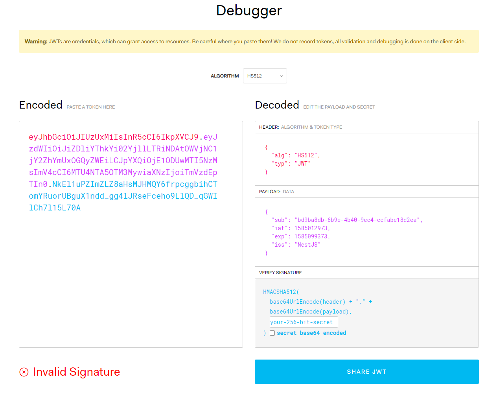

# NestJS 后端原型项目开发

## Description

[Nest](https://github.com/nestjs/nest) framework TypeScript starter repository.

## Installation

```bash
$ yarn
```

## Running the app

```bash
# development
$ yarn start:dev

# production mode
$ yarn start:prod
```


## 前置构思与问题综述

### 用户验证与增删改

1. 官方在JWT的实现上生成的JWT并不好，至少教程上是这样的，给我最大的感觉就是并没有完全按照 JWT 标准实现，按照阮一峰在其博客中写的那样（参考：[JSON Web Token 入门教程](**http://www.ruanyifeng.com/blog/2018/07/json_web_token-tutorial.html**)  ），最重要的第三部分 Signature 没有，所以存在篡改JWT的可能，具体如下图所示。因为签名这里需要满足以下结构才是一个正确的 JWT 格式 *HMACSHA256( base64UrlEncode(header) +"." + base64UrlEncode(payload) , secret)*



### 系统级接口

1. Log4JS，官方在文档中说明了可以重新覆盖实现 `LoggerService ` 以满足系统自身需求，那么作为附属品，Log4JS 就需要在不破坏原框架设计前提下去实现这里。按照本系统预期的设计架构，配置文件应该是存放在`src/configuration` 目录下的，并且需要对开发与生产环境做不同细节上的调整。
2. PM.JS，

